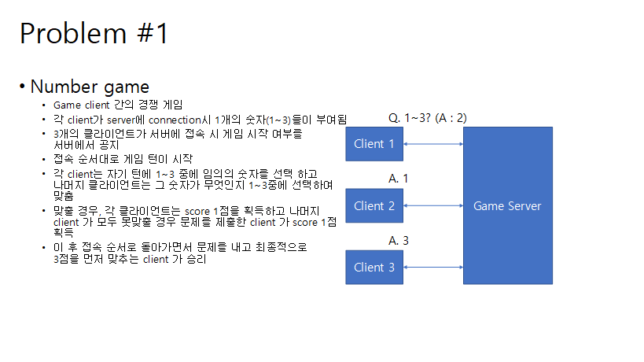
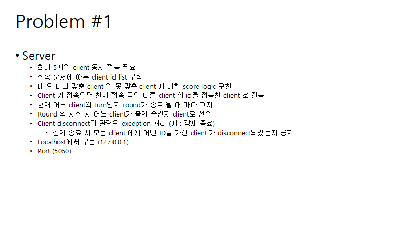
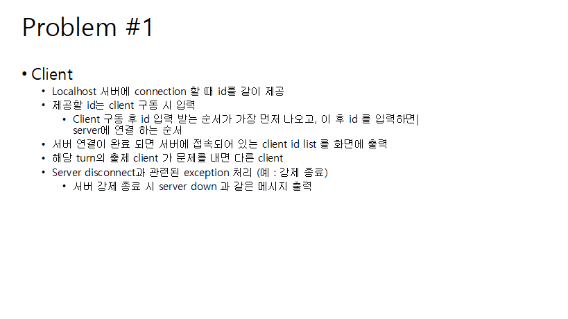

# simple_number_game
[use] `python,socket,threading`

## How to use
1. Excute Server.py
1. Excute Client.py(until 5)

## Detail

### (clinet.py _23) I want to limit when clinet could respod
- when server want to hear client's response, send message with '+++'

### (server.py _64) how to deal user imfomation
- I put serveral list and dict outside of threading so that it works independently witout being interfered with by outher threading

> it would be better to use dict more than serveral list

### (server.py _20) menagement connection state
> It is difficult to immediately confirm that clients are disconnected because client's response are limited

> if client exit during the game, the program shut down

### (server.py _104) Maximam limit
- by using `raise` to handle it through the disconnecion mechanism

### (server.py _214) the reason for using dict to manage client's answers

1. because need to know who gave right answer in which round.
2. because the owner client has to know other client have submitted the answer
3. more efficient to manage with kets than with idexes

## Improvements
[ ] Added process of receiving ID input
[ ] improvements disconnection mechanism 

